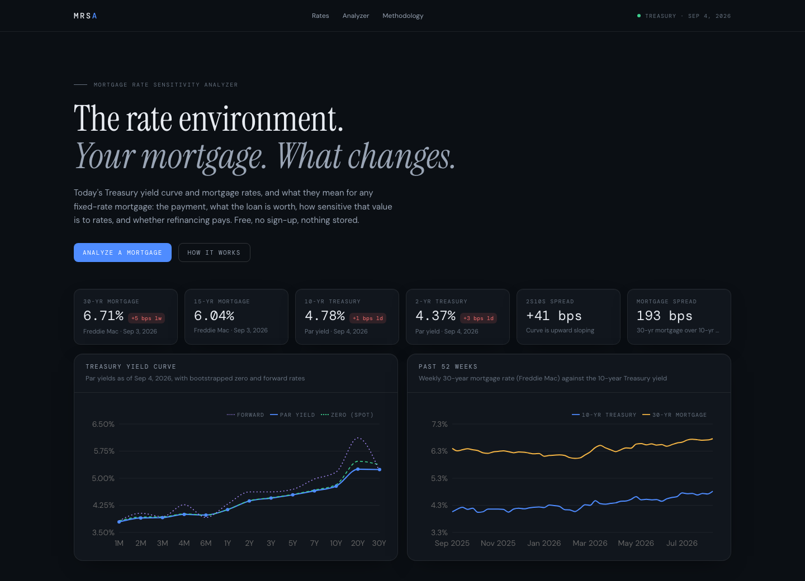

# MRSA · Mortgage Rate Sensitivity Analyzer

**Live at [mrsa.app](https://mrsa.app)** · API at [api.mrsa.app/api/docs](https://api.mrsa.app/api/docs)

MRSA shows what today's Treasury yield curve and mortgage rates mean for any fixed-rate mortgage. Enter a loan and it computes the payment, what the loan is worth to an investor, how sensitive that value is to interest rates, what happens under parallel, twist, and steepener rate shocks, and whether refinancing at today's rate pays for itself. It runs on public data, needs no sign-up, and stores nothing.



## What it computes

| Area | Outputs |
| --- | --- |
| Rate environment | Live Treasury par yields for 13 tenors, bootstrapped zero and forward curves, 2s10s spread and inversion flag, Freddie Mac 30- and 15-year mortgage rates, 52 weeks of history |
| Loan | Scheduled payment, seasoning, current or scheduled balance, remaining term and interest |
| Valuation | Present value, price as a percent of balance, yield, weighted average life, balance-weighted CPR |
| Rate risk | Effective duration, convexity, DV01, all measured by full repricing rather than closed-form approximations |
| Shocks | Parallel, twist, and steepener shocks with live P&L, a duration-only estimate for comparison, a twelve-scenario table from −200 to +300 bps, and the full price-versus-rate curve |
| Cash flows | Monthly and annual interest, scheduled principal, and prepayments under the chosen prepayment model, exportable as CSV |
| Refinance | New payment at the survey rate, monthly change, break-even on closing costs, lifetime interest comparison |

Prepayments can follow a constant CPR or a rate-driven model: housing turnover ramping to 6% CPR over 30 months plus a refinance response that follows an S-curve in the gap between the note rate and the market rate. Because that response feeds back into every shock, premium loans show the negative convexity real mortgages exhibit.

## Architecture

```
Browser ── React 19 · TypeScript · Vite · Tailwind · TanStack Query · Recharts
   │        Azure Static Web Apps (mrsa.app)
   │  JSON over HTTPS
   ▼
FastAPI ── Python 3.12 · NumPy · Pydantic · httpx
   │        Azure App Service, Linux (api.mrsa.app)
   │  cached, background-refreshed
   ▼
U.S. Treasury daily par yield curve XML · Freddie Mac PMMS CSV (FRED as fallback)
```

All financial computation runs on the server. The client owns rendering and state; every input is mirrored into the URL so any analysis can be shared as a link.

### Backend layout

```
backend/app
├── api/          routers: /api/health, /api/market, /api/curve, /api/analyze
├── data/         Treasury and mortgage-rate clients, async TTL cache with stale-on-error
├── finance/      yield-curve bootstrapping, loan cash flows, prepayment models, shocks, valuation, refinance
├── schemas/      Pydantic request and response models
├── services/     market snapshot assembly and the analysis orchestrator
└── main.py       app factory, CORS, gzip, startup cache warm-up
```

### Frontend layout

```
frontend/src
├── api/          typed client, response types, TanStack Query hooks
├── components/   layout and a small UI kit (cards, metrics, sliders, fields, tooltips)
├── features/     market hero, analyzer inputs and results, methodology
└── lib/          formatting, URL state, chart palette
```

## Methodology in brief

- **Zero curve.** Tenors of six months or less are treated as simple-interest zeros. Longer tenors are bootstrapped sequentially: each semi-annual par bond is priced off the zeros already solved, and the one unknown rate at its maturity is found by bisection so the bond prices at par. Rates between knots are linear.
- **Cash flows.** Level payment on the original terms; monthly interest, scheduled principal, and an expected prepayment from the CPR converted to a single monthly mortality.
- **Value.** Cash flows are discounted on the zero curve plus a spread. By default the spread is the current gap between the 30-year mortgage rate and the 10-year Treasury, so a loan written at today's rate is worth about par.
- **Risk.** Effective duration and convexity from ±50 bp repricing, DV01 from ±1 bp. Convexity is reported per 100 bp squared.
- **Shocks.** Applied to the zero curve; the mortgage rate moves with the 10-year point, which changes the refinance incentive and therefore prepayments.

The full explanation, including limitations, is on the site under Methodology.

## Local development

Backend (Python 3.12, [uv](https://docs.astral.sh/uv/)):

```bash
cd backend
uv sync --group dev
uv run uvicorn app.main:app --reload --port 8000
uv run pytest
```

Frontend (Node 22):

```bash
cd frontend
npm install
npm run dev
npm test
```

The Vite dev server proxies `/api` to `http://localhost:8000`. Interactive API docs are served at `/api/docs`.

Docker image for the API:

```bash
cd backend
docker build -t mrsa-api .
docker run -p 8000:8000 -e ALLOWED_ORIGINS=http://localhost:5173 mrsa-api
```

### Configuration

| Variable | Default | Purpose |
| --- | --- | --- |
| `ALLOWED_ORIGINS` | `http://localhost:5173,http://127.0.0.1:5173` | Comma-separated CORS origins |
| `TREASURY_CURRENT_YEAR_TTL_SECONDS` | `1800` | Refresh interval for the current year's Treasury feed |
| `MORTGAGE_RATES_TTL_SECONDS` | `21600` | Refresh interval for the Freddie Mac feed |
| `HISTORY_WEEKS` | `52` | Length of the rate history series |
| `VITE_API_BASE_URL` | empty | Frontend build-time API origin; empty uses the dev proxy |

## Deployment

Two GitHub Actions workflows deploy on push to `main`:

- `backend.yml` runs ruff and pytest, then deploys `backend/` to the Azure App Service and smoke-tests `/api/health`.
- `frontend.yml` runs lint, tests, and a production build, then uploads `dist/` to Azure Static Web Apps.

Required repository secrets: `AZURE_CREDENTIALS`, `AZURE_WEBAPP_NAME`, `AZURE_STATIC_WEB_APPS_API_TOKEN`, `VITE_API_BASE_URL`.

## Data sources

- [U.S. Department of the Treasury, Daily Treasury Par Yield Curve Rates](https://home.treasury.gov/resource-center/data-chart-center/interest-rates/TextView?type=daily_treasury_yield_curve)
- [Freddie Mac Primary Mortgage Market Survey](https://www.freddiemac.com/pmms)
- [FRED MORTGAGE30US / MORTGAGE15US](https://fred.stlouisfed.org/series/MORTGAGE30US) as a fallback

MRSA is an educational tool. Nothing on the site is investment, lending, or tax advice.

## License

MIT
